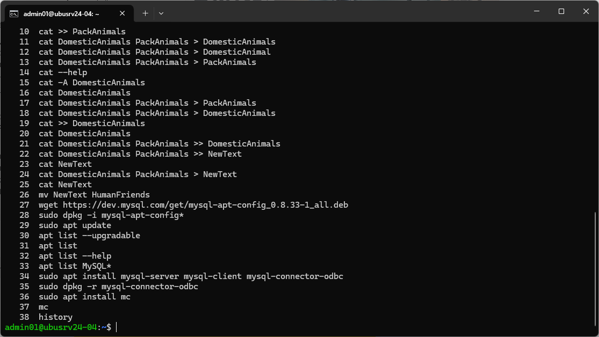
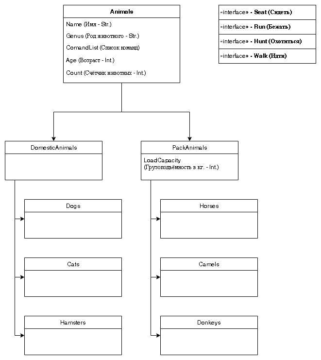
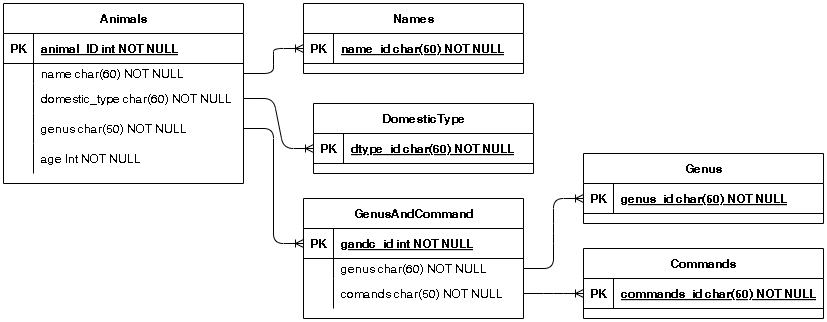
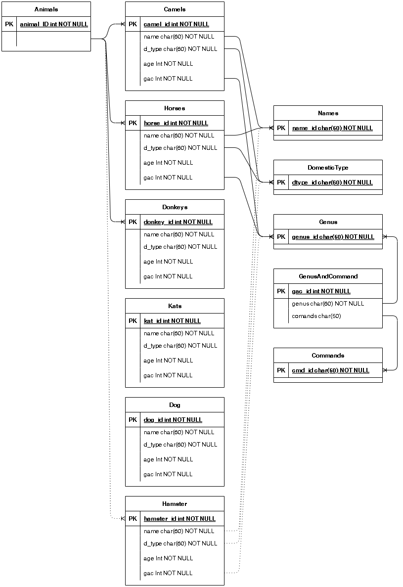
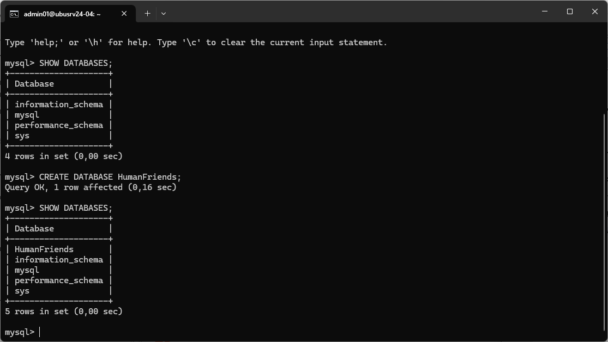

# Итоговая контрольная работа
## Информация о проекте
Необходимо организовать систему учета для питомника в котором живут
домашние и вьючные животные.
## Как сдавать проект
Для сдачи проекта необходимо создать отдельный общедоступный
репозиторий(Github, gitlub, или Bitbucket). Разработку вести в этом
репозитории, использовать пул реквесты на изменения. Программа должна
запускаться и работать, ошибок при выполнении программы быть не должно.
Программа, может использоваться в различных системах, поэтому необходимо
разработать класс в виде конструктора
## Задание 1.

1. Используя команду cat в терминале операционной системы Linux, создать
два файла Домашние животные (заполнив файл собаками, кошками,
хомяками) и Вьючные животными заполнив файл Лошадьми, верблюдами и
ослы), а затем объединить их. Просмотреть содержимое созданного файла.
Переименовать файл, дав ему новое имя (Друзья человека).

### Решение:
Создание файлов - Домашние животные (DomesticAnimals) и Вьючные животные (PackAnimals)

(комбинация клавиш Ctrl + d, оканчивает ввод текста)
```
cat >> DomesticAnimals
собаки
кошки
хомяки
```

```
cat >> PackAnimals
лошади
верблюды
ослы
```

Объединение файлов DomesticAnimals и PackAnimals в файл NewText
```
cat DomesticAnimals PackAnimals > NewText
```

Переименование файла NewText в файл HumanFriends
```
mv NewText HumanFriends
```

Просмотр файла HumanFriends
```
cat HumanFriends
```

## Задание 2.
2. Создать директорию, переместить файл туда.

### Решение:
Создать директорию animal

```
mkdir animal
```

Переместить файл Animals в директорию animal
```
mv Animals animal/Animals
```

## Задание 3. 4. 5.
3. Подключить дополнительный репозиторий MySQL. Установить любой пакет
из этого репозитория.

4. Установить и удалить deb-пакет с помощью dpkg.

5. Выложить историю команд в терминале ubuntu

### Решение:

Скачивание deb пакета с официального сайта разработчиков MySQL
```
wget https://dev.mysql.com/get/mysql-apt-config_0.8.33-1_all.deb
```

Установка пакета mysql-apt-config_0.8.33-1_all.deb
```
sudo dpkg -i mysql-apt-config*
```

Обновление списка пакетов в репозиториях
```
sudo apt update
```

Просмотр доступных пакетов MySQL
```
apt list MySQL*
```

Установка клиента, сервера MySQL и коннектора для ODBC
```
sudo apt install mysql-server mysql-client mysql-connector-odbc
```

Удаление пакета 
```
sudo dpkg -r mysql-connector-odbc
```

Выложить историю команд в терминале



## Задание 6.
6. Нарисовать диаграмму, в которой есть класс родительский класс, домашние
животные и вьючные животные, в составы которых в случае домашних
животных войдут классы: собаки, кошки, хомяки, а в класс вьючные животные
войдут: Лошади, верблюды и ослы).

### Решение:


Следует отметить. Что диаграмма классов для базы данных не подходит. 

Диаграмма базы данных должна выглядеть следующим образом:



Однако, для решения последующих заданий база данных должна быть не совсем
оптимальной и будет выглядеть следующим образом: 




## Задание 7.
7. В подключенном MySQL репозитории создать базу данных “Друзья человека”

### Решение:

Подключение к MySQL
```
mysql -u root -p
```

Просмотр списка существующих баз в MySQL
```
SHOW DATABASES;
```

Создание базы “Друзья человека” (HumanFriends)
```
CREATE DATABASE HumanFriends
```



## Задание 8.
8. Создать таблицы с иерархией из диаграммы в БД

### Решение:
```dtd
CREATE TABLE Genus ( genus_id VARCHAR(10) NOT NULL, PRIMARY KEY (genus_id));
CREATE TABLE Commands ( cmd_id VARCHAR(5) NOT NULL, PRIMARY KEY (cmd_id));
CREATE TABLE DomesticType ( dtype_id VARCHAR(20) NOT NULL, PRIMARY KEY (dtype_id));
CREATE TABLE Names ( name_id VARCHAR(60) NOT NULL, PRIMARY KEY (name_id));

CREATE TABLE GenusAndCommand ( gac_id INT NOT NULL AUTO_INCREMENT,
        genus VARCHAR(60)NOT NULL, command VARCHAR(5) NOT NULL,
        PRIMARY KEY (gac_id),
        FOREIGN KEY (genus) REFERENCES Genus (genus_id),
        FOREIGN KEY (command) REFERENCES Commands (cmd_id));

CREATE TABLE Camels ( camel_id INT NOT NULL AUTO_INCREMENT,
        name VARCHAR(60) NOT NULL, d_type VARCHAR(20) NOT NULL,
        birthDate DATE NOT NULL, gac VARCHAR(10) NOT NULL,
        PRIMARY KEY (camel_id),
        FOREIGN KEY (name) REFERENCES Names (name_id),
        FOREIGN KEY (d_type) REFERENCES DomesticType (dtype_id),
        FOREIGN KEY (gac) REFERENCES Genus (genus_id));

CREATE TABLE Horses ( horse_id INT NOT NULL AUTO_INCREMENT,
        name VARCHAR(60) NOT NULL, d_type VARCHAR(20) NOT NULL,
        birthDate DATE NOT NULL, gac VARCHAR(10) NOT NULL,
        PRIMARY KEY (horse_id),
        FOREIGN KEY (name) REFERENCES Names (name_id),
        FOREIGN KEY (d_type) REFERENCES DomesticType (dtype_id),
        FOREIGN KEY (gac) REFERENCES Genus (genus_id));

CREATE TABLE Donkeys ( donkey_id INT NOT NULL AUTO_INCREMENT,
        name VARCHAR(60) NOT NULL, d_type VARCHAR(20) NOT NULL,
        birthDate DATE NOT NULL, gac VARCHAR(10) NOT NULL,
        PRIMARY KEY (donkey_id),
        FOREIGN KEY (name) REFERENCES Names (name_id),
        FOREIGN KEY (d_type) REFERENCES DomesticType (dtype_id),
        FOREIGN KEY (gac) REFERENCES Genus (genus_id));

CREATE TABLE Cats ( dat_id INT NOT NULL AUTO_INCREMENT,
        name VARCHAR(60) NOT NULL, d_type VARCHAR(20) NOT NULL,
        birthDate DATE NOT NULL, gac VARCHAR(10) NOT NULL,
        PRIMARY KEY (cat_id),
        FOREIGN KEY (name) REFERENCES Names (name_id),
        FOREIGN KEY (d_type) REFERENCES DomesticType (dtype_id),
        FOREIGN KEY (gac) REFERENCES Genus (genus_id));

CREATE TABLE Dogs ( dog_id INT NOT NULL AUTO_INCREMENT,
        name VARCHAR(60) NOT NULL, d_type VARCHAR(20) NOT NULL,
        birthDate DATE NOT NULL, gac VARCHAR(10) NOT NULL,
        PRIMARY KEY (dog_id),
        FOREIGN KEY (name) REFERENCES Names (name_id),
        FOREIGN KEY (d_type) REFERENCES DomesticType (dtype_id),
        FOREIGN KEY (gac) REFERENCES Genus (genus_id));

CREATE TABLE Hamsters ( hamster_id INT NOT NULL AUTO_INCREMENT,
        name VARCHAR(60) NOT NULL, d_type VARCHAR(20) NOT NULL,
        birthDate DATE NOT NULL, gac VARCHAR(10) NOT NULL,
        PRIMARY KEY (hamster_id),
        FOREIGN KEY (name) REFERENCES Names (name_id),
        FOREIGN KEY (d_type) REFERENCES DomesticType (dtype_id),
        FOREIGN KEY (gac) REFERENCES Genus (genus_id));
```
## Задание 9.
9. Заполнить низкоуровневые таблицы именами(животных), командами
которые они выполняют и датами рождения

### Решение:
```dtd
INSERT INTO Genus (genus_id)
        VALUES ("camel"), ("horse"), ("donkey"), ("cat"), ("dog"), ("hamster");

INSERT INTO Commands (cmd_id)
        VALUES ("run"), ("seat"), ("walk"), ("hunt");

INSERT INTO GenusAndCommand (genus, command)
        VALUES
        ("camel", "run"),
        ("camel", "walk"),
        ("camel", "seat"),
        ("horse", "run"),
        ("horse", "walk"),
        ("donkey", "walk"),
        ("cat", "hunt"),
        ("dog", "seat"),
        ("dog", "walk"),
        ("dog", "hunt"),
        ("dog", "run"),
        ("hamster", "run");

INSERT INTO DomesticType (dtype_id)
        VALUES ("domestic animals"), ("pack animals");
        
INSERT INTO Camels ( name, d_type, birthDate, gac)
        VALUES
        ("Цезарь", "pack animals", "2023-10-16", "camel"),
        ("Князь", "pack animals", "2020-1-17", "camel");

INSERT INTO Horses ( name, d_type, birthDate, gac)
        VALUES
        ("Черный Красавчик", "pack animals", "2022-8-6", "horse"),
        ("Росинант", "pack animals", "2020-7-18", "horse");

INSERT INTO Donkeys ( name, d_type, birthDate, gac)
        VALUES
        ("Серый", "pack animals", "2023-7-22", "donkey"),
        ("Иа", "pack animals", "2025-1-9", "donkey");

INSERT INTO Dogs ( name, d_type, birthDate, gac)
        VALUES
        ("Бобик", "domestic animals", "2019-10-16", "dog"),
        ("Шарик", "domestic animals", "2024-6-11", "dog");

INSERT INTO Cats ( name, d_type, birthDate, gac)
        VALUES
        ("Барсик", "domestic animals", "2022-10-16", "cat"),
        ("Пушок", "domestic animals", "2020-3-17", "cat");

INSERT INTO Hamsters ( name, d_type, birthDate, gac)
        VALUES
        ("Хомка", "domestic animals", "2023-10-16", "hamster");


```
## Задание 10.
10. Удалив из таблицы верблюдов, т.к. верблюдов решили перевезти в другой
    питомник на зимовку. Объединить таблицы лошади, и ослы в одну таблицу.

### Решение:
Удаление значений из таблицы "Camels"
```dtd
DELETE FROM Camels;
```
Для объединения таблиц лошадей и ослов - создаём новую таблицу "DonkeyAndHorse"
```dtd
CREATE TABLE DonkeyAndHorse ( dah_id INT NOT NULL AUTO_INCREMENT,
        name VARCHAR(60) NOT NULL, d_type VARCHAR(20) NOT NULL,
        birthDate DATE NOT NULL, gac VARCHAR(10) NOT NULL,
        PRIMARY KEY (dah_id),
        FOREIGN KEY (name) REFERENCES Names (name_id),
        FOREIGN KEY (d_type) REFERENCES DomesticType (dtype_id),
        FOREIGN KEY (gac) REFERENCES Genus (genus_id));
```
Заполняем таблицу "DonkeyAndHorse" значениями из предыдущих таблиц
```dtd    
INSERT INTO DonkeyAndHorse (name, d_type, birthDate, gac)
        SELECT name, d_type, birthDate, gac FROM Donkeys
        UNION ALL
        SELECT  name, d_type, birthDate, gac FROM Horses;
```
Удаляем таблицы лошадей и ослов
```dtd
DROP TABLE Horses, Donkeys;
```


12. Создать новую таблицу “молодые животные” в которую попадут все
животные старше 1 года, но младше 3 лет и в отдельном столбце с точностью
до месяца подсчитать возраст животных в новой таблице

13. Объединить все таблицы в одну, при этом сохраняя поля, указывающие на
прошлую принадлежность к старым таблицам.

14. Создать класс с инкапсуляцией методов и наследованием по диаграмме.

15. Написать программу, имитирующую работу реестра домашних животных.
В программе должен быть реализован следующий функционал:

    - Завести новое животное

    - Определять животное в правильный класс

    - Увидеть список команд, которое выполняет животное

    - Обучить животное новым командам

    - Реализовать навигацию по меню

16. Создайте класс Счетчик, у которого есть метод add(), увеличивающий̆
значение внутренней̆int переменной̆на 1 при нажатие “Завести новое
животное” Сделайте так, чтобы с объектом такого типа можно было работать в
блоке try-with-resources. Нужно бросить исключение, если работа с объектом
типа счетчик была не в ресурсном try и/или ресурс остался открыт. Значение
считать в ресурсе try, если при заведения животного заполнены все поля.
